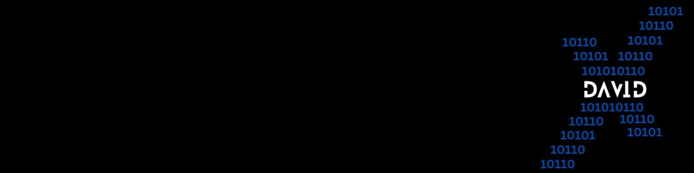

<h1>Hey, I am David Perez!  <a href="https://github.com/davperez-tech"> <a href="https://www.linkedin.com/in/daperezpuello/">Cybersecurity Professional</a>

<h2>🖥️ Cybersecurity Projects:</h2>

- <b>SOC in Azure (Microsoft Sentinel)</b>
  - [Coming soon...]()
    
<h2>📄 Certifications</h2>

- [CompTIA Security+](https://www.credly.com/badges/5f6c38cb-686e-4e9c-8709-117cea4f5e18/linked_in_profile)
- [CompTIA CySA+](https://www.credly.com/badges/655a427b-3cc2-4f90-b204-df1d84cd5c3e)
- [CompTIA Network+](https://www.credly.com/badges/955f7707-6551-4d53-90d1-176b6af6527a)
- [CCNA](https://www.credly.com/badges/0c57b9e6-d078-4fe8-b3f9-02108efee08e/linked_in_profile)
- [Linux Essentials](https://cs.lpi.org/caf/Xamman/certification/verify/LPI000639131/8tuf742e63)
    
<h2>🤳🏼 Connect with me:</h2>

[][linkedin]

[linkedin]: https://www.linkedin.com/in/daperezpuello/
